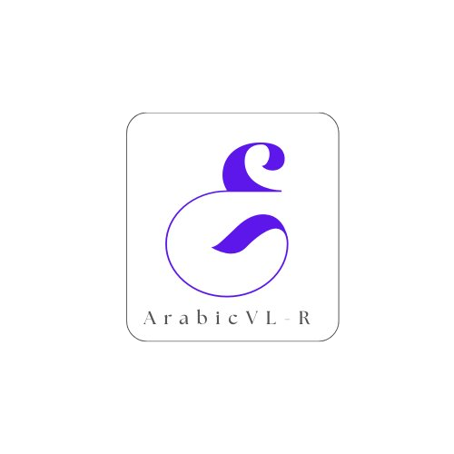

<div align="left">
  

# ArabicVL-R 🌙

**Arabic Vision Language Reasoning Benchmark** — A benchmark for evaluating structured multimodal reasoning in Arabic

> 📄 *"ArabicVL-R: A Benchmark for Arabic Vision Language Model Reasoning"*  
> | [Paper](#) | [Code](https://github.com/hadeelalseni/ArabicVL-R)

---

## 📖 Overview

**ArabicVL-R** is a benchmark for evaluating **vision-language model (VLM) reasoning in Arabic**. It focuses on structured multimodal reasoning for visual question answering by combining visual understanding with step-by-step textual inference in **Modern Standard Arabic (MSA)**.

The benchmark is built by translating and linguistically adapting curated subsets of three English VL reasoning datasets — **DVQA**, **CLEVR**, and **IconQA** — sourced from the [LLaVA-CoT-o1-Instruct](https://huggingface.co/datasets/5CD-AI/LLaVA-CoT-o1-Instruct) dataset on Hugging Face. Each example is augmented with a structured 4-step Arabic reasoning trace (`<SUMMARY>`, `<CAPTION>`, `<REASONING>`, `<CONCLUSION>`), generated automatically using GPT-4o and Gemini, and validated with an LLM judge. The DVQA subset additionally includes **bilingual image pairs** — the original English-text charts alongside Arabic-text versions generated by Gemini.

The benchmark evaluates **Qwen2.5-VL-7B-Instruct** fine-tuned with QLoRA under Arabic prompting, revealing a substantial cross-lingual performance gap in current VLMs.

---

## ✨ Key Features

- **4-part structured reasoning traces** — every example contains `<SUMMARY>`, `<CAPTION>`, `<REASONING>`, `<CONCLUSION>` annotations generated using GPT-4o
- **Three source datasets** — chart QA (DVQA), 3D scene reasoning (CLEVR), icon-based QA (IconQA)
- **Bilingual image pairs** — DVQA subset includes Arabic-text and English-text versions of each chart image, produced using Gemini
- **Full fine-tuning pipeline** — QLoRA fine-tuning of Qwen2.5-VL-7B-Instruct on the Arabic dataset with W&B tracking
- **Robust evaluation** — Arabic number normalization, `<CONCLUSION>` tag extraction, and exact-match scoring

---

## 🗂️ Repository Structure

```
ArabicVL-R/
├── dataset/
│   ├── dvqa_augmented.jsonl        # 500 chart QA pairs (Arabic + English image pairs)
│   ├── validated_clevr.jsonl       # 2,251 3D scene reasoning pairs
│   ├── validated_iconqa.jsonl      # 2,265 icon-based QA pairs
│   └── Arabic_LLava.jsonl          # 5,017 combined records (all three sources)
├── images/
│   ├── arabic_images/              # Arabic-text chart images (DVQA)
│   ├── english_images/             # English-text chart images (DVQA)
│   ├── CLEVR/                      # CLEVR 3D scene images
│   └── IconQA/                     # IconQA abstract icon images
├── notebooks/
│   ├── Image_Translation.ipynb     # Translates DVQA chart images to Arabic using Gemini
│   ├── Arabic_Dataset_Builder.ipynb # Builds Arabic QA + reasoning traces using GPT-4o
│   └── finetune_eval.ipynb         # QLoRA fine-tuning and evaluation of Qwen2.5-VL-7B
└── README.md
```

---

## 📦 Dataset

### Summary

| File | Source | Records | Notes |
|------|--------|---------|-------|
| `dvqa_augmented.jsonl` | DVQA | 500 | Bar chart QA; has `arabic_image` + `english_image` fields |
| `validated_clevr.jsonl` | CLEVR | 2,251 | Counting, arithmetic, spatial reasoning on 3D scenes |
| `validated_iconqa.jsonl` | IconQA | 2,265 | MCQ and fill-in-the-blank with abstract icon images |
| `Arabic_LLava.jsonl` | All three | 5,017 | Full combined dataset used for fine-tuning |

### Schema

**DVQA** (`dvqa_augmented.jsonl`) — has bilingual image fields:
```json
{
  "id": "dvqa/images/bar_train_00182598.png",
  "image": "images/arabic_images/arabic_image_0.png",
  "arabic_image": "images/arabic_images/arabic_image_0.png",
  "english_image": "images/english_images/english_image_0.png",
  "question": "ما هو مجموع كافة القيم في مجموعة بارد؟",
  "ground_truth": "11",
  "augmented_answer": "<SUMMARY>...</SUMMARY>\n<CAPTION>...</CAPTION>\n<REASONING>...</REASONING>\n<CONCLUSION>11</CONCLUSION>"
}
```

**CLEVR / IconQA / Arabic_LLava** — single image field:
```json
{
  "id": "CLEVR/CLEVR_v1.0/images/train/CLEVR_train_036012.png",
  "image": "images/CLEVR/CLEVR_CLEVR_v1.0_images_train_CLEVR_train_036012.png",
  "question": "أضف 7 أشياء صغيرة بنفسجية. كم عدد الأشياء الصغيرة بنفسجية الموجودة؟",
  "ground_truth": "8",
  "augmented_answer": "<SUMMARY>...</SUMMARY>\n<CAPTION>...</CAPTION>\n<REASONING>...</REASONING>\n<CONCLUSION>8</CONCLUSION>"
}
```

### Reasoning Trace Format

Every `augmented_answer` follows a 4-step chain-of-thought structure:

| Tag | Purpose |
|-----|---------|
| `<SUMMARY>` | Brief description of the approach to solving the problem |
| `<CAPTION>` | Description of the visual elements in the image relevant to the question |
| `<REASONING>` | Step-by-step logical inference leading to the answer |
| `<CONCLUSION>` | Final answer (extracted during evaluation) |

---

## 🔧 Notebooks

### 1. `Image_Translation.ipynb` — Chart Image Translation
Translates English DVQA chart images into Arabic using **Gemini** (`google-genai`).

- Loads DVQA samples from the `5CD-AI/LLaVA-CoT-o1-Instruct` Hugging Face dataset
- Sends each chart image to Gemini to regenerate it with Arabic text labels
- Saves output as `arabic_images/` alongside original `english_images/`

**Key dependencies:** `google-genai`, `datasets`, `pillow`, `tqdm`

---

### 2. `Arabic_Dataset_Builder.ipynb` — Arabic QA + Reasoning Trace Generation
Builds the Arabic VQA dataset with structured reasoning using **GPT-4o**.

- Loads source datasets (DVQA, CLEVR, IconQA) from Hugging Face
- Converts each image to base64 and sends it with its question to GPT-4o
- GPT-4o generates a full Arabic answer in the `<SUMMARY>/<CAPTION>/<REASONING>/<CONCLUSION>` format
- A separate **GPT-4o judge** validates quality and semantic correctness
- Supports resumption via `load_existing_ids()` to skip already-processed samples

**Key dependencies:** `openai`, `datasets`, `pillow`, `tqdm`

---

### 3. `finetune_eval.ipynb` — Fine-tuning & Evaluation
End-to-end QLoRA fine-tuning of **Qwen2.5-VL-7B-Instruct** on `Arabic_LLava.jsonl`, followed by exact-match evaluation.

**Data splits:**
```
Train: 80% | Validation: 10% | Test: 10%   (seed=42)
```

**Model & quantization:**
```
Model        : Qwen/Qwen2.5-VL-7B-Instruct
Quantization : 4-bit NF4 (BitsAndBytes, double quant, bfloat16)
```

**LoRA configuration:**
```python
r              = 8
lora_alpha     = 16
lora_dropout   = 0.05
target_modules = ["q_proj", "k_proj", "v_proj", "o_proj"]
task_type      = CAUSAL_LM
```

**Training arguments:**
```python
per_device_train_batch_size  = 1
gradient_accumulation_steps  = 16
num_train_epochs             = 2
learning_rate                = 2e-4
bf16                         = True
gradient_checkpointing       = True
optim                        = paged_adamw_8bit
max_grad_norm                = 0.3
eval_steps / save_steps      = 400
```

**Experiment tracking:** Weights & Biases (`qwen-vl-arabic` project, run `qwenvl_lora_augmented`)

**Evaluation:**
- Answers extracted from `<CONCLUSION>` tags
- Arabic written numbers normalized to digits (e.g. `ثلاثة` → `3`)
- Metric: **Exact Match** accuracy
- Results logged to W&B including a full predictions table

**Key dependencies:** `transformers>=4.41.0`, `peft`, `bitsandbytes`, `accelerate`, `qwen-vl-utils`, `wandb`

---

## 🚀 Getting Started

### Clone

```bash
git clone https://github.com/hadeelalseni/ArabicVL-R.git
cd ArabicVL-R
```

### Install Dependencies

```bash
pip install transformers>=4.41.0 datasets accelerate peft bitsandbytes pillow wandb
pip install qwen-vl-utils openai google-genai tqdm
```

### Step 1 — Translate Chart Images to Arabic

Open and run `notebooks/Image_Translation.ipynb`.  
Set your `GOOGLE_API_KEY` in the notebook. Outputs saved to `images/arabic_images/`.

### Step 2 — Build the Arabic Dataset

Open and run `notebooks/Arabic_Dataset_Builder.ipynb`.  
Set your `OPENAI_API_KEY`. Outputs the per-source JSONL files and the combined `Arabic_LLava.jsonl`.

### Step 3 — Fine-tune and Evaluate

Open and run `notebooks/finetune_eval.ipynb`.  
The notebook handles splitting, tokenization, training, and evaluation end-to-end.

### Load the Dataset Directly

```python
import json

with open("dataset/Arabic_LLava.jsonl") as f:
    data = [json.loads(line) for line in f]

print(f"Total examples: {len(data)}")  # 5,017

sample = data[0]
print("Question :", sample["question"])
print("Answer   :", sample["ground_truth"])
print("Reasoning:", sample["augmented_answer"])
```

---

## 📊 Evaluation

The benchmark evaluates models under two prompting settings to measure the cross-lingual gap:

| Setting | Description |
|---------|-------------|
| 🇸🇦 **Arabic prompting** | Questions in MSA; model reasons and answers in Arabic |
| 🇬🇧 **English prompting** | Same images with English questions; used as reference |

Results reveal a **substantial cross-lingual performance gap**, demonstrating current limitations of VLMs in Arabic multimodal reasoning.

---

## 📜 Citation

If you use ArabicVL-R in your research, please cite:

```bibtex
@article{arabicvlr2025,
  title  = {ArabicVL-R: A Benchmark for Arabic Vision Language Model Reasoning},
  author = {Sarah and Manar and Hadeel and Ragheed and Mourad},
  year   = {2025},
  url    = {https://github.com/hadeelalseni/ArabicVL-R}
}
```

---

## 📬 Contact

For questions, issues, or collaboration, please open a GitHub issue.

---

<div align="center">
<em>Bridging the gap in Arabic multimodal reasoning — one step at a time. 🌍</em>
</div>

